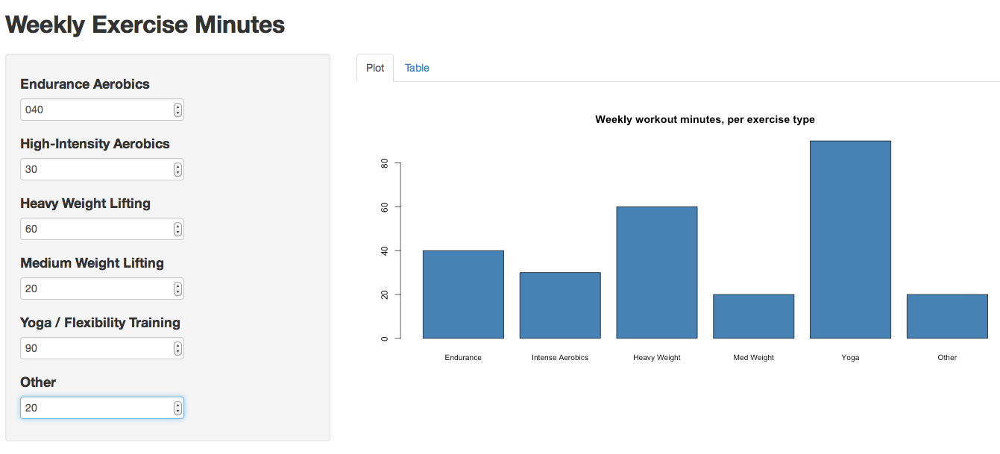

## App Instructions: 

This app provides a user interface for dynamically logggin and plotting weekly workout minutes. The user can enter the number of minutes they spent exercising during the week as they apply to each category, and instantly see both a barplot (tab 1) and a table (tab 2) that visaulize/summarize the data. 

---

## Example Code - ui.R

The ui.R code captures User input for different types of workouts as numeric values.

```{r}
# sidebarLayout(
#                 sidebarPanel(
#                         numericInput("endurance", label = h4("Endurance Aerobics"), value = 0, min=0, max=200, step=1),
#
#               ....................

```

```{r}

#                 mainPanel(
#                         tabsetPanel(type="tabs",
#                                     tabPanel("Plot", plotOutput("plot")),
#                                     tabPanel("Table", tableOutput("table"))
#                         )

```

---

## Example Code - server.R

server.R code then captures each value, as it's updatae, and uses it to form both the bar plot and table. 

```{r}
#   values = reactive({
#           data.frame("Endurance" <- input$endurance, 
#                "Intense Aerobics" <- input$speed, 
#                 ...............
```

```{r}
#   labels = c("Endurance", "Intense Aerobics", "Heavy Weight", "Med Weight", "Flex", "Other")
#   output$plot = renderPlot({
#          
#     barplot(as.numeric(values()[1,]),
#          main = 'Weekly workout minutes, per exercise type',
#          names.arg = labels,
#          cex.names = 0.85,
#          col="steelblue") })

```
- These are just snippets of the longer program.

--- 

## Screenshot

An example of how the final outcome might appear:




